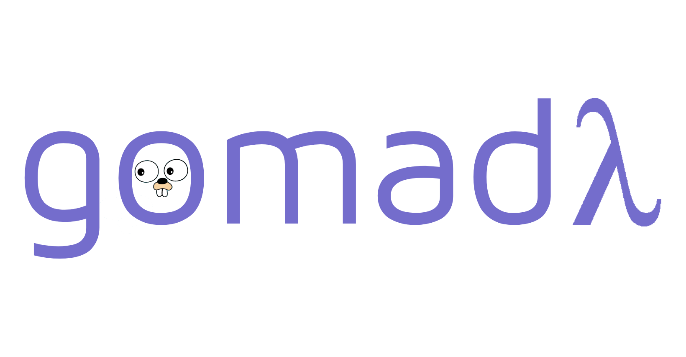

[](https://github.com/medmouine/gomad)
[](https://github.com/medmouine/gomad/actions/workflows/test.yml)
[](https://github.com/medmouine/gomad/actions/workflows/lint.yml)
[](https://pkg.go.dev/github.com/medmouine/gomad/maybe)
[](https://codecov.io/gh/medmouine/gomad)
[](https://opensource.org/licenses/Apache-2.0)



# **GOMAD**: Functional Patterns in Golang
- [Prerequisites](#prerequisites)
- [Install](#install)
- [Modules](#modules)
  * [Maybe](#maybe)
    + [Usage](#usage)
  * [Either](#either)
  * [Result](#result)


### This package is still in an early stage of development. Feel free to open a PR and contribute or just open an issue to help me priorities features.

Following is a list of featured and upcoming modules in no specific order:

- [X] Eq
- [X] Ord
- [X] Semigroup
- [X] Monoid
- [X] IO
- [X] Maybe
- [X] Either
- [X] Result
- [ ] List
- [ ] Pipe
- [ ] HKT
- [ ] Monad
- [ ] IO
- [ ] Task
- [ ] Reader

## Prerequisites
All these modules use the newly added features of Golang v1.18 (Still in beta as of today) notably type and function generics.

## Install

```
go get github.com/medmouine/gomad/<Desired module>

i.e
go get github.com/medmouine/gomad/maybe
```

### Modules
## Maybe
```
go get github.com/medmouine/gomad/maybe
```
`Maybe` is a monadic pattern allowing for data manipulation while abstracting whether or not the value actually exists or is `nil`. For example, if we fetch data from an external API that could be `nil`, we can still perform manipulation on it while disregarding its actual state. The `Maybe` struct will take care of managing the value itself. This is similar to the Maybe interface in [Elm](https://package.elm-lang.org/packages/elm/core/latest/Maybe) or [Haskell](https://wiki.haskell.org/Maybe) or [Optional in Java](https://docs.oracle.com/javase/8/docs/api/java/util/Optional.html). This is helpful for CRUD operations by simplifying the code and allowing for seamless manipulation of nullable data.

You can use the functions `Just`, `None` or `Nillable` to instanciate a `Maybe` struct. The type parameter will be determined by the passed argument or by specifying it. For example:
```
maybeNilInteger := maybe.Nillable[int](nil)

nilInteger := maybe.None[int]()

someInteger := maybe.Just[int](1)
```

#### Usage

- ##### Example 1 Nil Value
```
nilInt := maybe.None[int]()
nilInt.Map(func(i int) int { return i + 1 })
```
The `Map` call does nothing since myint is nil. We also can't unwrap it since it's a nil value (will panic otherwise).

We can however return an alternative value:
```
nilInt.Or(99) // returns 99 (alternative value)
```

- ##### Example 2 Some Value (not `nil`)
```
someInt := maybe.Just(3)
someInt.
    Map(func(i int) int { return i + 1 }).
    Unwrap() // returns 4 (3 + 1)
```
if we give an alternative value, we still get the actual value since it's not `nil`.

```
someInt.
    Map(func(i int) int { return i + 1 }).
    Or(99) // returns 4 (original value mapped)
```

- ##### Example 3 Nillable Value (unsure if `nil` or not)
```
nilPerson := new(Person)
nilPerson = nil
maybePerson := maybe.Nillable(nilPerson)
maybePersonMapped := maybePerson.Map(func(p Person) Person {
    return Person{name: "john"}
  }) 
maybePersonMapped.IsNil() // true
maybePersonMapped.
    Or(Person{name: "jane"}).
    name // returns "jane"
```
We get a `Person` with its `name` attribute equal to `jane` which is the alternative value we provided since the actual one is `nil`.

- ##### Example 4: Nillable Value (unsure if `nil` or not) + Map existing value

```
somePerson := &Person{name: "foo"}
maybePerson := maybe.Nillable(somePerson) maybePersonMapped := maybePerson.
    Map(func(p Person) Person {
        return Person{name: "bar"}
}) 
maybePersonMapped.IsNil()  // false
maybePersonMapped.IsSome() // true 
maybePersonMapped. 
    Or(Person{name: "jane"}).
    name // returns "bar" (original value mapped)
```
We get a `Person` with its `name` attribute equal to `bar` which is the original value after the `Map` call since the actual value is `Person{name: "foo"}` (not `nil`).

```
maybePersonMapped := maybePerson.map(func(p Person) Person {
    person2 := p
    person2.name := person2.name + "bar"
    return person2
}) 

maybePersonMapped.IsNil() // false 
maybePersonMapped.IsSome() // true 
maybePersonMapped. 
    Or(Person{name: "jane"}). 
    name // returns "foobar" (original value mapped)
```
We get a `Person` with its `name` attribute equal to `foobar` which is the original value after the `Map` call since the actual value is `Person{name: "foobar"}` (not `nil`).

------

## Either
```
go get github.com/medmouine/gomad/either
```
Allows to manipulate pairs of mutually exclusive data. For example, if we would want to fall back to a value B if A answers to a specific predicate. This interface allows integrating this behavior seamlessly by abstracting all the underlying logic of managing both values. A common use case for this is form validation for front-end applications.

WIP 🚧

------

## Result
```
go get github.com/medmouine/gomad/result
```
This interface aim at abstracting all logic related to operations susceptible to failures, such as external API calls, etc. It offers constructors and methods to safely manipulate the result in case of success and handle errors gracefully in case of failure.

WIP 🚧
